# Set up Viva Connections for the site

> [!NOTE]
> To set up Viva Connections, you need to be a Microsoft 365 administrator. If you are not an administrator, please contact your IT department for assistance.

This process is the same, regardless of which template you want to set up. These instructions are the brief, single path to success required to instantiate these templates. You should still understand how Viva Connections works, and how to configure it for your organization. For more information, see [Set up Viva Connections in the Microsoft 365 admin center](https://learn.microsoft.com/en-us/viva/connections/set-up-admin-center).

## Navigate to the Viva Connections admin center

In the Microsoft 365 Admin Center, navigate to **Settings / Viva**.

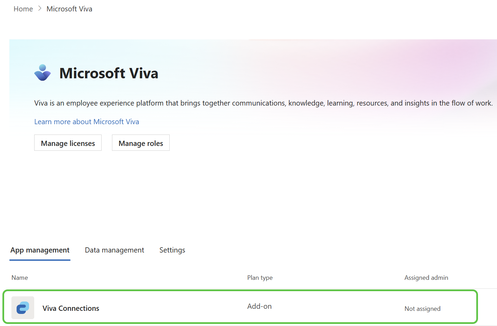

The first item in the list should be Viva Connections. Click on it to open the Viva Connections admin center.

Next, you'll see several Viva Connections options. The first one is **Create and manage Viva Connections experiences**. Click it.

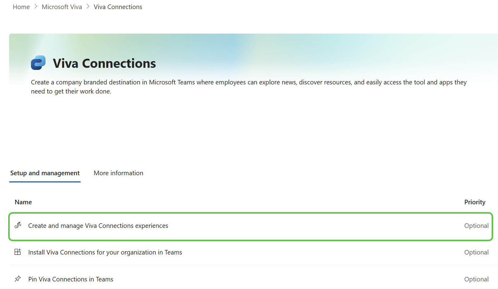

## Create new Viva Connections experience

Click on the **Create new** button. Enter a name for the experience, and select the site you created as the home site. Then click **Next**.

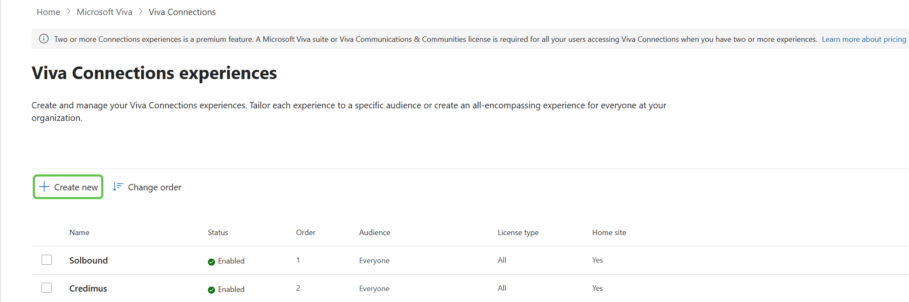

### Build from an existing portal

You've just created the site you'll use as the "portal", so click on **Build from an existing portal to set a home site**. Click **Next**.

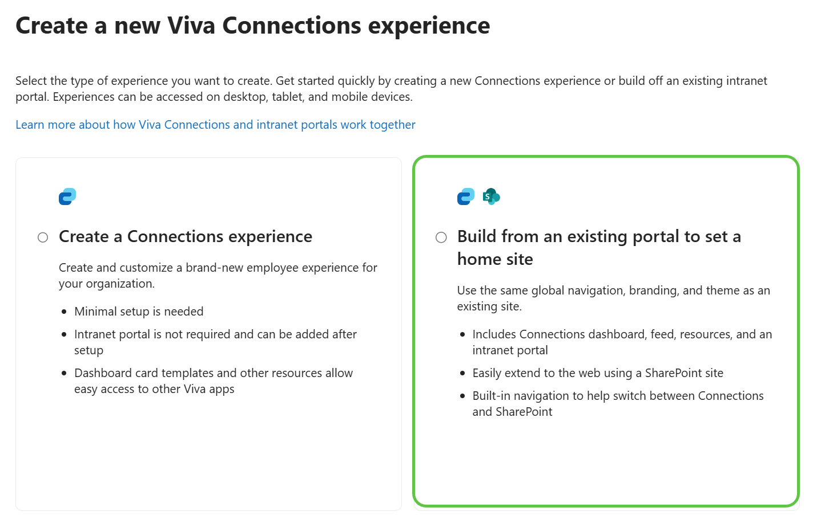

### Add url for the new site

Add the url for the new site you created. If the url is valid, you'll see a green message saying "This site can be set as your home site." Click **Next**.

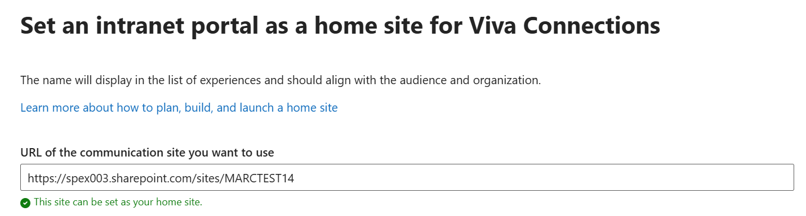

### Review and finish

There's not much to see here, so click **Create experience**.

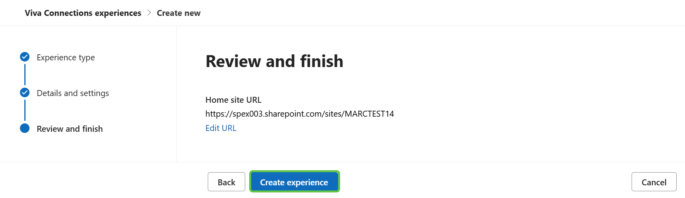

### Confirmation

Even less to see here, so click **Close**.

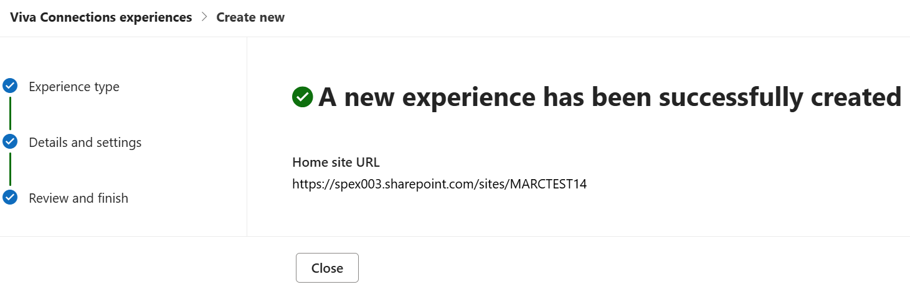

### Enable the experience

While you've created the experience for the site, it is in a draft state. The following steps enable the experience to be available in the site. Click on the name of the experience (the Site Title for your site).

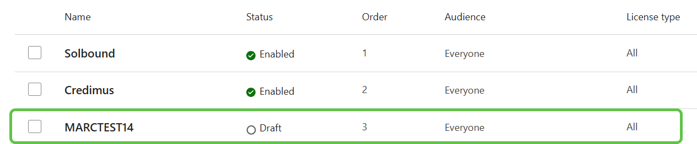

Clkcik on the **Edit status** link in the upper right corner of the page.

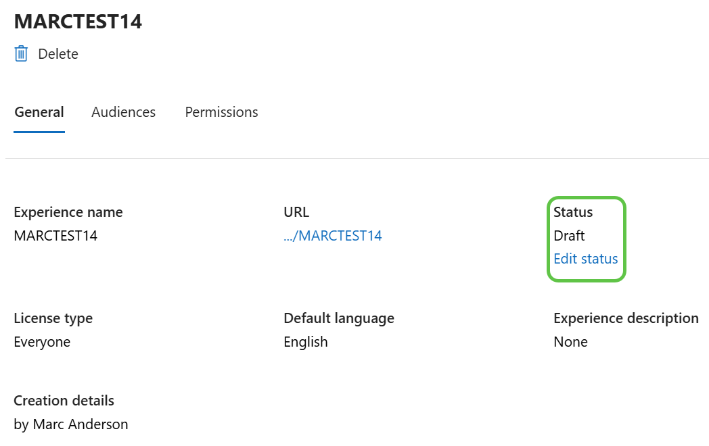

Check the **Enable experience** checkbox, and click **Save**.

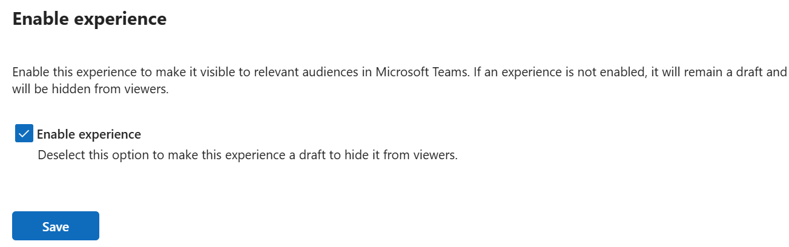

Now you should see the experience is enabled. You're in good shape, and you can return to the rest of the instructions.

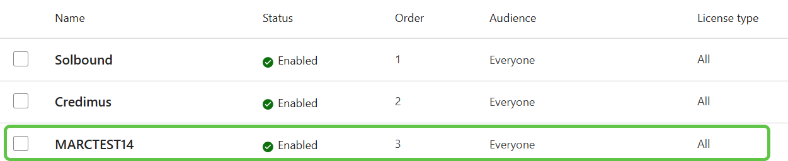

