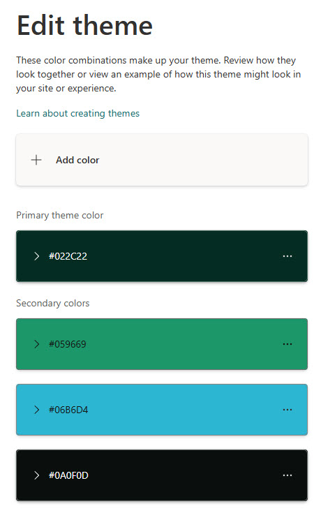
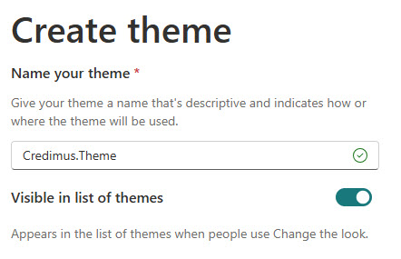
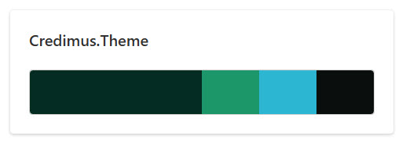
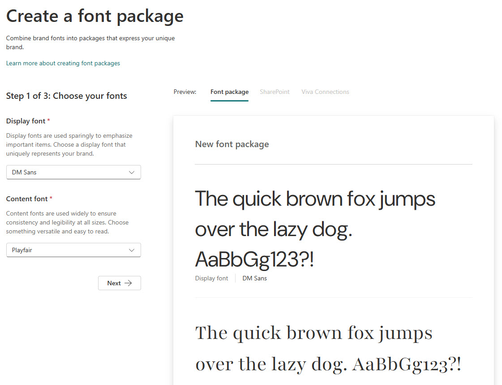
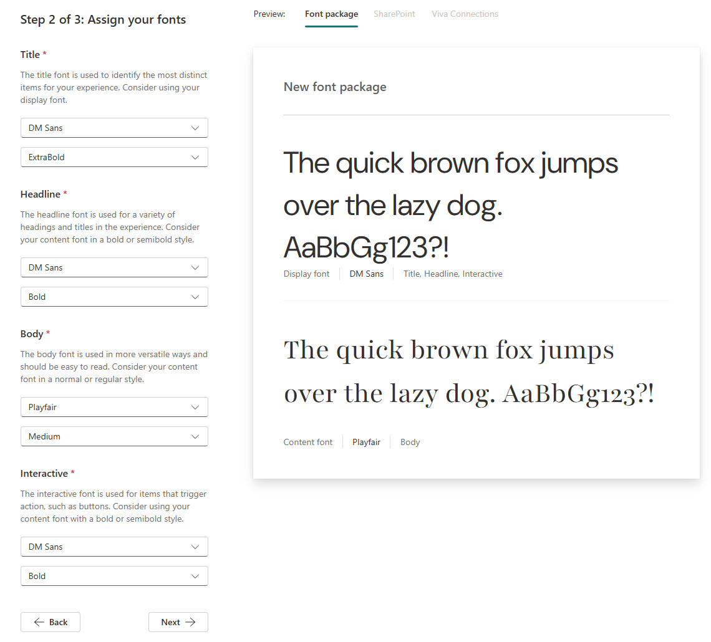
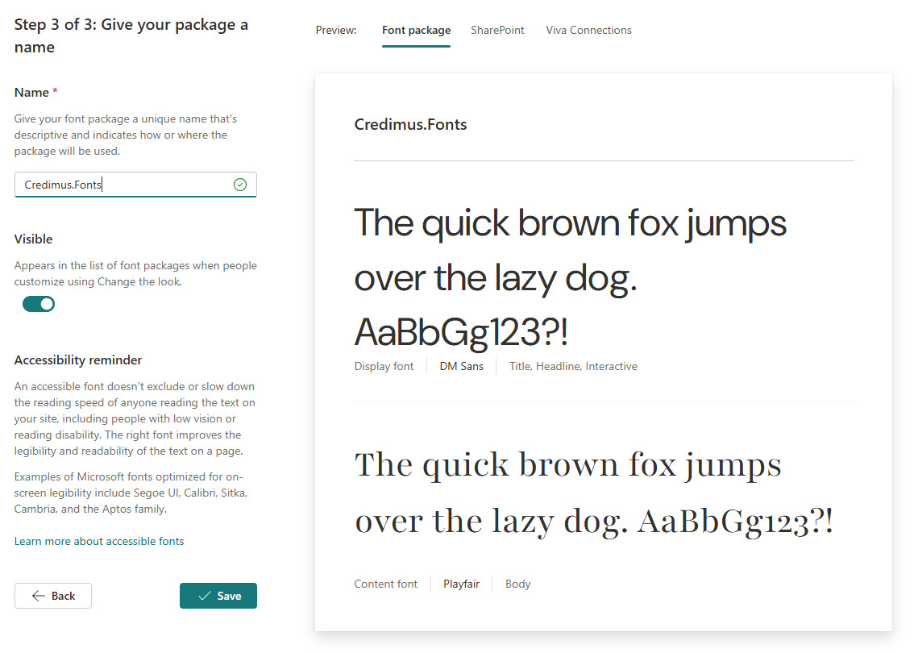
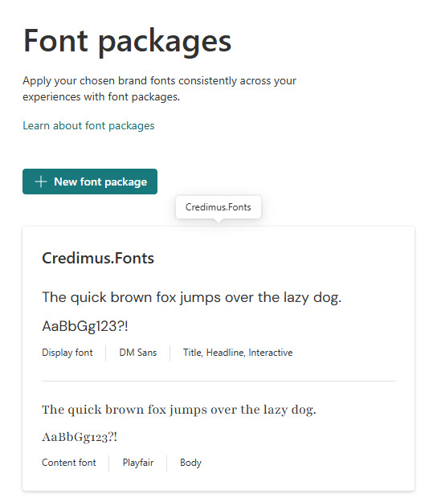
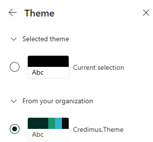
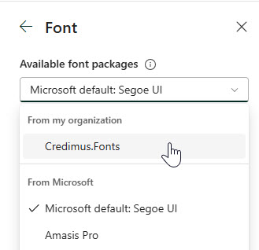

# Installation Instructions

These installation instructions are streamlined as much as possible, with the goal to get you from start to finish as quickly as possible. If you encounter a topic with which you are not familiar, the instructions link out to Microsoft Learn articles with more specifics.

Installing the Credimus site requires several steps:

- Create a new Communication Site in your tenant
- Run the PowerShell script to apply the PnP Provisioning template
- Configure the Brand Center
- Configure Viva Connections
- Configure the Credimus site

## Prerequisites

For most of these instructions, you should have the SharePoint Admin role. While some steps can be accomplished by the Site Owner, it will be most expeditious to follow all the instructions with the SharePoint Admin role.

Any exceptions to the above (for example, where Global Administrator permissions are required) are noted in each step.

## Prepare

### Create a new Communication Site

Create a new Communication Site named *Credimus*, using the default template. If you need instructions to create this site, please refer to the support article [Create a communication site in SharePoint](https://support.microsoft.com/office/create-a-communication-site-in-sharepoint-7fb44b20-a72f-4d2c-9173-fc8f59ba50eb).

Be sure to make yourself the Site Owner of the Communication Site. You can add additional Site Owners or Site Members now or later in the site itself.

Throughout the rest of these instructions, you will be either making changes to this site or setting up artifacts in other locations which will support this site, its branding, and its functionality.

### Download ZIP file

Download the [Credimus ZIP file](./Credimus.zip). This ZIP file contains all the necessary files to apply the PnP Provisioning template, as well as the images and fonts used in the site.

### Extract all files in ZIP file

We recommend you extract the ZIP file into a folder in the root of your machine, for example */code/Credimus*. This will ensure that the folder paths won't be too long for the script to run successfully.

>Note: The ZIP file contains additional files, should you want to automate more of the implementation. These files can also be used as documentation for the process, in addition to these instructions.

## Apply PnP Provisioning template

The base definition for the site is contained in the PnP Provisioning template file. This file can be found in the folder *PnP Provisioning*, and is named *PnP-Provisioning-CredimusSite - RAW.pnp*.

The script *ApplyPnPProvisioningTemplate-Credimus.ps1* applies the PnP Provisioning template to the site you have created above. The script also performs some additional configuration which cannot be contained in the PnP Provisioning template for technical reasons.

The template contains information about the lists and libraries, pages, and images contained in the site.

To run the script, you will need to update the variables at the top of the script to reflect your tenant and site information. Then, you can run the script. For detailed instructions, see [Applying PnP Templates to SharePoint Sites](https://learn.microsoft.com/sharepoint/dev/solution-guidance/applying-pnp-templates).

You will be asked to log in with your credentials twice, once to connect to the SharePoint Admin Center to ensure the site you specified exists, and a second time to connect to that site. Then the script will run through several steps, applying the template and making the additional configurations.

## Configure Brand Center

In order for the site to look like what you see in the screenshots, you'll need to make a set of configurations in the Brand Center. We've made sure to suggest naming conventions which allow you to easily identify where the configuration settings have come from and how they are used, specifically with prefixes which reflect the demo site's name.

If your tenant does not have a Brand Center already, see the article [SharePoint brand center](https://learn.microsoft.com/sharepoint/brand-center-overview). Setting up a Brand Center requires Global Administrator permissions.

If you already have a Brand Center, the default location is */sites/BrandGuide*, though yours may be in a location you chose when you set it up.

### Create theme colors

For this site, you should add the following colors into your Brand Colors. Each is prefixed with the name of the site so you can identify them easily. 

>Note: there is no way to remove Brand Colors in the UI, though you can do so with PowerShell. For detailed instructions, see [Brand Colors](https://learn.microsoft.com/sharepoint/brand-colors).

| Color Name | Color Code | Color |
|---|---|---|
| Credimus.DarkTeal | #022C22 |  |
| Credimus.DeepEmerald | #059669 |  |
| Credimus.CyanEdge | #06B6D4 |  |
| Credimus.Carbon | #0A0F0D |  |
| | |

### Set up theme

Once you have the Brand Colors defined, you use them to set up a theme. For detailed instructions, see [Site theme](https://learn.microsoft.com/sharepoint/site-theme).

#### Add the theme colors

First, you add the colors to the theme. Add the colors in the order listed above.

#### Name the theme

Next, give the theme the name *Credimus.Theme*, and Save.

#### Review the theme

Finally, the theme should look like this is you have set it up correctly.

### Upload fonts

The site uses several custom fonts to enhance its look and feel. You need to upload specific font files to support the site. These font files are not prefixed. For each font family, you need to upload a set of font files, each of which contains variants on the font for use the Font Package, which we will create next. For detailed instructions, see [Brand Fonts](https://learn.microsoft.com/sharepoint/brand-fonts).

Credimus uses the custom fonts *DM Sans* and *Playfair*. The appropriate files are in the *Fonts* folder.

### Create Font Package

Font Packages combine sets of fonts for use in a site which has the Font Package enabled. For detailed instructions, see [Font packages](https://learn.microsoft.com/sharepoint/brand-center-font-packages).

| Font Slot | Font Name | Font Variant |
|---|---|---|
| Title | DM Sans | ExtraBold |
| Headline | DM Sans | Bold |
| Body | Playfair | Medium |
| Interactive | DM Sans | Bold |
| | | |

#### Choose your fonts

#### Assign your fonts

#### Give your package a name

### Review font package

Review the settings to ensure you have created the Font Package correctly.

## Viva Connections

Viva Connections - soon to be renamed SharePoint Connections - enables us to create experiences for use in a site or sites. By enabling the experience in a site, you can use the Dashboard Web Part in pages to provide ACES.

### Create Viva Connections experience for site

TBD

## Final site configuration

These final steps apply the configurations you have set up above in the site itself.

### Change the look

Go  to the gear, and select Change the look.

#### Apply theme

Select Theme and choose the Credimus.Theme and Save.

#### Apply Font Package

Enable the Font Package you created above under Fonts.

### Edit home page

#### Add dashboard actions

In the home page of the site, find the Dashboard Web Part. If you'd like to match the ACES you've seen in the demo site, you can set them up following the instructions in the following table. If you'd like to customize it for your organization, you may choose to add ACES which reflect that thinking.

| Link Name | Link Settings |
|---|---|
| | |

